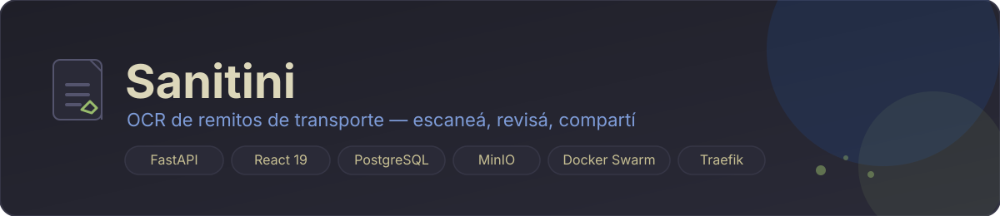
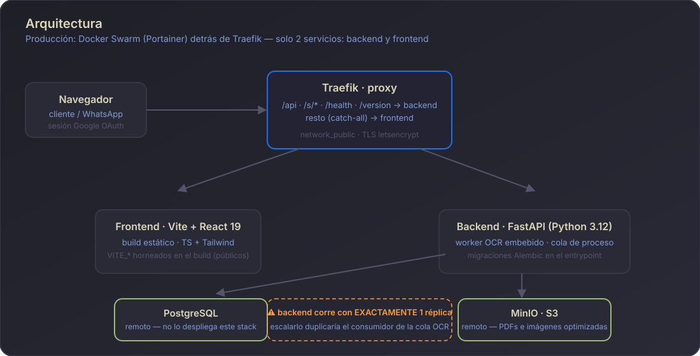

# Sanitini — Remitos

[](https://github.com/fer336/sistema-ocr/actions/workflows/ci.yml)
[](https://github.com/fer336/sistema-ocr/tags)
[](https://github.com/fer336/sistema-ocr/commits/main)

Sistema interno de remitos de transporte con lectura **OCR**: escaneás el remito, el backend lo lee con Gemini y lo convierte en un registro con cliente, número y estado. El tablero lo muestra, lo podés descargar en varios formatos y compartirlo por WhatsApp con un **link corto que nunca vence**. El acceso es por Google OAuth con lista blanca de emails — es una herramienta del cliente, no un producto público.

## Quick path

Levantar el entorno de desarrollo en tres pasos (detalle abajo):

1. Backend: `cd backend && python -m venv .venv && source .venv/bin/activate && pip install -r requirements.txt && cp env.example .env` → completar valores → `alembic upgrade head` → `uvicorn app.main:app --reload` (+ `python -m app.worker.run` en otra terminal).
2. Frontend: `cd frontend && npm install && cp .env.example .env` → completar `VITE_GOOGLE_CLIENT_ID` → `npm run dev`.
3. Verificá: `http://localhost:5173` con tu cuenta de Google. Listo.

## Qué hace

| Capacidad | Cómo |
|-----------|------|
| OCR automático | Gemini (modelo configurable), cola de proceso con batch y reintentos |
| Optimización de imagen | redimensiona y recodifica antes del OCR (tamaño, calidad y dimensiones configurables) |
| Tablero | totales por estado, duplicados y últimos remitos |
| Búsqueda y filtros | por fecha, estado y texto |
| Columnas reordenables | drag & drop en la tabla, orden persistido por usuario |
| Descarga | original, optimizado o preview (link prefirmado de 15 min) |
| Compartir | links cortos permanentes `{PUBLIC_BASE_URL}/s/{code}` para WhatsApp |
| Acceso | Google OAuth + allowlist de emails, sesión JWT en cookie httpOnly |
| Salud | `/health` y `/version` — la release verifica ambos contra producción (INF-503) |

## Arquitectura



| Pieza | Detalle |
|-------|---------|
| Traefik | enruta `/api`, `/s/*`, `/health` y `/version` al backend; todo lo demás (catch-all) al frontend |
| Backend | FastAPI + SQLAlchemy async + Alembic (Python 3.12); migraciones al arrancar, antes de servir tráfico |
| Worker OCR | `python -m app.worker.run`, **embebido** en el contenedor de backend — exige exactamente 1 réplica (Perfil A) |
| Frontend | Vite + React 19 + TypeScript + Tailwind; los `VITE_*` quedan horneados en el build (nunca secretos) |
| Postgres / MinIO | infraestructura **remota ya existente**, no la despliega este stack (ver `docs/DEVIATIONS.md`) |

En producción el stack es **Docker Swarm** (Portainer) detrás de Traefik, no Compose standalone. Solo hay dos servicios Swarm: `backend` y `frontend`.

## Desarrollo local

```bash
docker compose up -d postgres minio     # únicos dos servicios con estado (opcional: ver abajo)

cd backend && python -m venv .venv && source .venv/bin/activate
pip install -r requirements.txt
cp env.example .env                     # completar valores
alembic upgrade head
uvicorn app.main:app --reload           # otra terminal: python -m app.worker.run

cd ../frontend
npm install
cp .env.example .env                    # completar VITE_GOOGLE_CLIENT_ID
npm run dev
```

Detalles en [`backend/README.md`](backend/README.md) y [`frontend/README.md`](frontend/README.md).

- Solo hacen falta **dos** `.env` en local: `backend/.env` y `frontend/.env`. Nada en la raíz del repo, a propósito.
- Postgres/MinIO locales en Docker son **opcionales**: el flujo de dev puede apuntar directo a los remotos (los valores van en `backend/.env`). `docker-compose.override.yml` reusa `backend/.env` como fuente de credenciales para esos contenedores (mismo mecanismo que `remitos_env` en producción, ver `docker/postgres/` y `docker/minio/`).
- `docker compose up` sin filtrar servicios arranca backend+frontend tal como se buildean en CI, pero **sin puertos publicados**: en producción el único punto de entrada es Traefik (labels en `docker-compose.yml`), que no existe en un Compose local. Para probar esas imágenes hay que publicar puertos a mano (`docker compose run --rm -p 8000:8000 backend ...` o un override propio no versionado) — no es el loop de desarrollo del día a día.

## Deployment

La infraestructura sigue el estándar Qeva. Fuentes de verdad:

- [`INFRASTRUCTURE.md`](INFRASTRUCTURE.md) — reglas obligatorias de Docker, Compose, Portainer, releases y secrets.
- [`infra.project.yml`](infra.project.yml) — instanciación del estándar para este proyecto (org, imágenes, secret, healthcheck, servicios).
- [`AGENTS.md`](AGENTS.md) — resumen operativo para agentes y contribuidores.
- [`docs/DEVIATIONS.md`](docs/DEVIATIONS.md) — desviaciones registradas del estándar.

**Producción es release-driven**: se despliega publicando un tag SemVer (`vMAJOR.MINOR.PATCH`), que dispara `.github/workflows/release.yml`. Los pushes y PRs solo ejecutan CI (`.github/workflows/ci.yml`) y nunca tocan producción. Cada release termina con health **y** version check contra el dominio real: un `200` con la versión anterior es un deployment fallido.

### Configuración requerida en GitHub

Cargar en **Settings → Secrets and variables → Actions**:

| Tipo     | Nombre                   | Contenido                                                                    |
| -------- | ------------------------ | ---------------------------------------------------------------------------- |
| Secret   | `GHCR_TOKEN`             | PAT clásico con `write:packages` (+ `repo` si el repo es privado) para publicar en `ghcr.io/fer336/remitos-*`. |
| Secret   | `PORTAINER_WEBHOOK_URL`  | URL del webhook del stack en Portainer.                                       |
| Variable | `PRODUCTION_HEALTH_URL`  | URL pública del healthcheck del backend, p.ej. `https://<dominio>/health`.     |
| Variable | `VITE_GOOGLE_CLIENT_ID`  | Google OAuth *client id* (público: queda embebido en el bundle del frontend). |

La configuración de runtime (contraseñas, API keys, JWT) **no** va a GitHub: vive en el único Docker Secret `remitos_env` administrado desde Portainer y montado en `/run/secrets/remitos_env`. Lo consume únicamente `backend` (el worker corre embebido en ese contenedor; `frontend` no tiene config de runtime).

### Contenido de `remitos_env` en Portainer

Crear una sola vez en **Portainer → Secrets → remitos_env**, pegando algo así (con valores reales, nunca estos):

```env
# Postgres y MinIO son remotos (infraestructura ya existente, no la levanta
# este stack) -- acá van los datos de CONEXIÓN, no credenciales de bootstrap
# (no hace falta POSTGRES_USER/PASSWORD/DB ni MINIO_ROOT_USER/PASSWORD: eso
# solo lo necesita docker/postgres y docker/minio para el flujo de dev local
# opcional, que usa backend/.env, no este secret).
DATABASE_URL=postgresql+asyncpg://<user>:<password>@<host>:5432/santini

MINIO_ENDPOINT=<endpoint>
MINIO_ACCESS_KEY=<access-key>
MINIO_SECRET_KEY=<secret-key>
MINIO_BUCKET=santini-remitos
MINIO_SECURE=true
MINIO_PRESIGNED_EXPIRES_SECONDS=900

GEMINI_API_KEY=<key>
OCR_MODEL=models/gemini-3.5-flash-lite
OCR_TIMEOUT_SECONDS=120
OCR_MAX_RETRIES=3

TARGET_IMAGE_SIZE_KB=300
IMAGE_MAX_WIDTH=2200
IMAGE_MAX_HEIGHT=2200
IMAGE_START_QUALITY=88
IMAGE_MIN_QUALITY=55

MAX_UPLOAD_MB=25
PROCESSING_BATCH_SIZE=3
MAX_CONCURRENT_OCR=3

GOOGLE_OAUTH_CLIENT_ID=<client-id>
JWT_SECRET_KEY=<openssl rand -hex 32>
JWT_EXPIRES_MINUTES=10080
ALLOWED_GOOGLE_EMAILS=
SESSION_COOKIE_NAME=remitos_session
SESSION_COOKIE_SECURE=true
SESSION_COOKIE_SAMESITE=lax

CORS_ORIGINS=https://<dominio>
PUBLIC_BASE_URL=https://<dominio>
```

`MINIO_ENDPOINT` y `DATABASE_URL` apuntan a los hosts remotos reales, no a nombres de servicio de Docker — no existen contenedores con esos nombres en el stack. `PUBLIC_BASE_URL` es la base de los links cortos de WhatsApp (`{PUBLIC_BASE_URL}/s/{code}`): sin el dominio real, esos links no funcionan para quien los recibe fuera del sistema.

> **Pendiente conocido**: `INFRASTRUCTURE.md` §11 exige `.env.example` (con punto). El archivo existe como `backend/env.example` (sin punto) — falta `mv backend/env.example backend/.env.example`. `frontend/.env.example` ya tiene el nombre correcto.

## Checklist

Para revisar un entorno o una release:

- [ ] `/health` responde `{"status":"ok"}` y `/version` responde `{"version":"vX.Y.Z"}` en producción.
- [ ] El tag de la imagen desplegada coincide con el tag de la release (nunca `latest` ni tags flotantes).
- [ ] `docker-compose.yml` en `main` está pineado al último tag y `APP_VERSION` coincide.
- [ ] El compose se actualizó y pusheó **antes** del webhook de Portainer (orden obligatorio §6).
- [ ] `backend/.env` / `frontend/.env` no están commiteados; `env.example`s actualizados.
- [ ] Al compartir un remito, el mensaje sale con `{PUBLIC_BASE_URL}/s/{code}` (corto) y el link abre el archivo.
- [ ] `remitos_env` tiene `PUBLIC_BASE_URL` con el dominio real (sin eso, los links cortos quedan rotos).
- [ ] Backend corre con exactamente 1 réplica (escalarlo duplica el consumidor de la cola OCR).

## Siguiente paso

- Empezá por [`INFRASTRUCTURE.md`](INFRASTRUCTURE.md) si vas a tocar infraestructura, compose o releases.
- Cualquier desviación de las reglas requiere entrada aprobada por un humano en [`docs/DEVIATIONS.md`](docs/DEVIATIONS.md) (INF-901).
- Los agentes de IA leen [`AGENTS.md`](AGENTS.md) al operar sobre este repo — mantenelo al día.